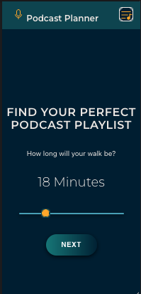
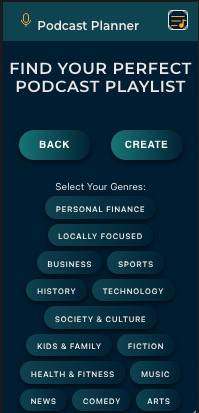
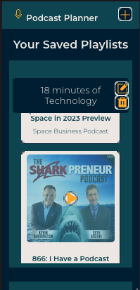

# Podcast Planner: Create your perfect podcast playlist for every walk    

[Podcast Planner Live Link](https://podcast-planner-app.netlify.app/)

## About

Welcome to Podcast Planner, a React application built at Juno College of Technology (formerly HackerYou), designed to help users optimize their walking time with their favorite podcasts. With Podcast Planner, users can easily fill their walking time with as many podcasts as possible, based on their preferred genres and walking time.

To get started, users can enter how long they would like to walk and choose one or more genres of the podcast they are interested in. The app will then generate a list of podcasts that will fill the length of the user's walk. Users can then name and save this list into a personal playlist, which is fully editable. Users can remove playlists they are not interested in, re-order the playlist, and select multiple genres to be included in the playlist.

Podcast Planner was built by these members of Cohort #46, from Juno's Immersive Bootcamp. 

* [Haley Tibbitts](https://github.com/haleytibbitts)
* [Renata Reinartz](https://github.com/renata1026)
* [Richard Tillo](https://github.com/richardJET)
* [Scott Cheung](https://github.com/luckyNoodles)

Thank you for your interest in Podcast Planner! We hope you find it useful and look forward to hearing from you.    

## Advanced Web Development tools used in this project

**The Podcast Planner app is built with lots of love and also:**

* Mobile first design
* React library
* Additional libraries used in this project:
    * Sweet Alerts 2
    * Axios
    * Framer Motion
* SASS was used in CSS styling
* Firebase is used to store saved podcast playlists
* Content is generated using the Listen Notes API (https://www.listennotes.com/api/)

## Features

* Customizable Walk Time: Users can enter their desired walking time.
* Genre Selection: Users can choose one or more podcast genres that they are interested in.
* Automatic Playlist Generation: The app generates a list of podcasts that will fill the length of the  user's walk based on their selected genres and walking time.
* Personalized Playlists: Users can name and save their playlists as personal playlists.
* Editable Playlists: Personal playlists are editable, so users can remove playlists they are not interested in.
* Desktop Drag and drop to reorder playlists (Planned: Touch drag and drop)
* Multi-genre Selection: Users can include multiple podcast genres in their personal playlists.
* Podcast Player: The app includes a podcast player with the following features:
    * Play and Pause controls
    * Fast forward and rewind slider
    * Volume and Mute controls

## Screenshots

<table>
  <tr>
    <td></td>
    <td></td>
    <td></td>
    <td></td>
  </tr>
</table>

 

